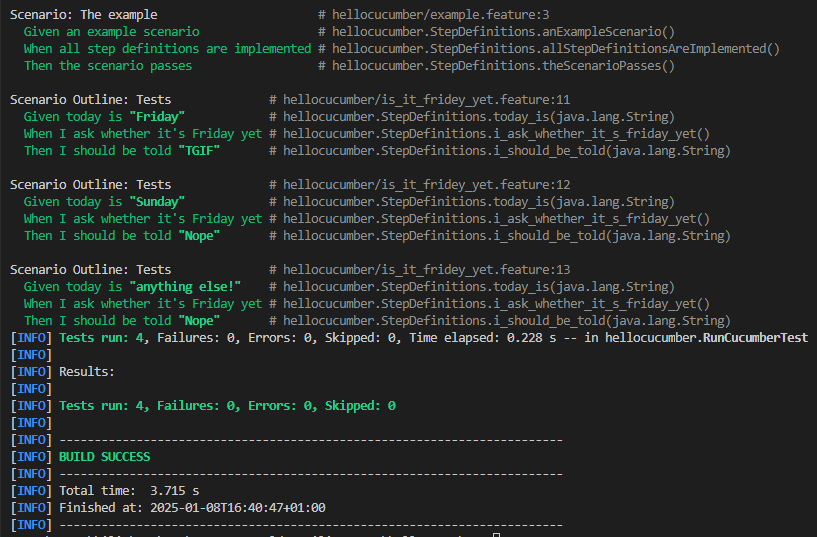
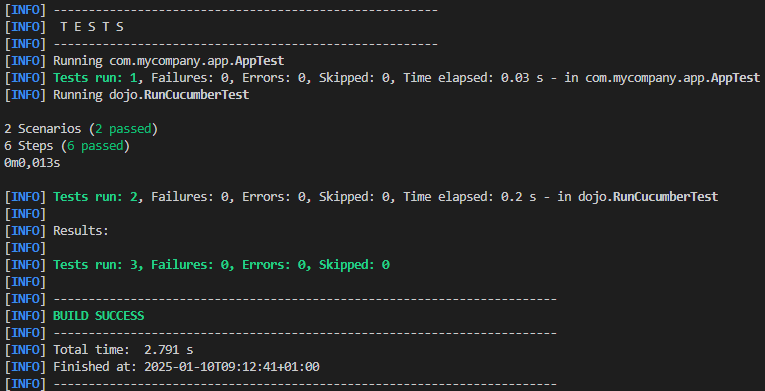
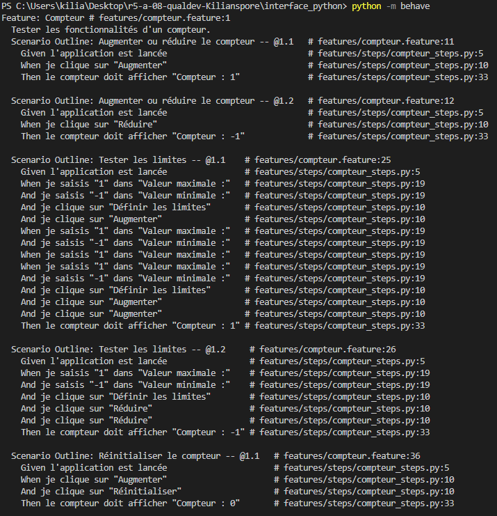
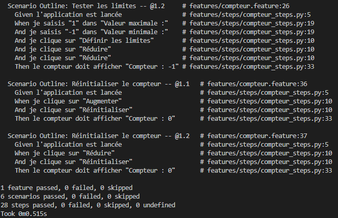

= R5.A.08 -- Dépôt pour les TPs
:icons: font
:MoSCoW: https://fr.wikipedia.org/wiki/M%C3%A9thode_MoSCoW[MoSCoW]

Ce dépôt concerne les rendus de mailto:A_changer@etu.univ-tlse2.fr[Jonh Doe].

== TP1

.Code de is_it_friday.feature
```gherkin
Feature: Is it Friday yet?
  Everybody wants to know when it's Friday
    Scenario Outline: Tests
        Given today is "<day>"
        When I ask whether it's Friday yet
        Then I should be told "<answer>"
        Examples:
            | day             | answer |
            | Friday          | TGIF  | 
            | Sunday          | Nope  |
            | anything else   | Nope  |
```

.Les tests du tp1 passent


== TP2

.Code de Order.java
[source,java]
package dojo;
import java.util.ArrayList;
import java.util.List;
class Order {
    String owner;
    String target;
    List<String> drinks = new ArrayList<>();
    public void declareOwner(String owner) {
        this.owner = owner;
    }
    public void declareTarget(String target) {
        this.target = target;
    }
    public List<String> getDrinks() {
        return drinks;
    }
}

.Les tests du TP2 passent


== TP3
Lors de mon stage de deuxième année, j'ai développé une application en python. Étant donné que j'ai aussi du développer un site et le lier à une base de données, je n'ai pas eu le temps d'implementer des tests très poussés, c'est donc pour ça que j'ai fait le choix de repartir sur une interface python pour voir et comprendre comment réaliser des tests, avec python.

.Code de compteur.feature
```gherkin
Feature: Compteur
  Tester les fonctionnalités d'un compteur.

  Scenario Outline: Augmenter ou réduire le compteur
    Given l'application est lancée
    When je clique sur "<action>"
    Then le compteur doit afficher "Compteur : <valeur_attendue>"

    Examples:
      | action       | valeur_attendue |
      | Augmenter    | 1               |
      | Réduire      | -1              |

  Scenario Outline: Tester les limites
    Given l'application est lancée
    When je saisis "<valeur_max>" dans "Valeur maximale :"
    And je saisis "<valeur_min>" dans "Valeur minimale :"
    And je clique sur "Définir les limites"
    And je clique sur "<action>"
    And je clique sur "<action>"
    Then le compteur doit afficher "Compteur : <valeur_attendue>"

    Examples:
      | valeur_max | valeur_min | action       | valeur_attendue |
      | 1          | -1         | Augmenter    | 1               |
      | 1          | -1         | Réduire      | -1              |

  Scenario Outline: Réinitialiser le compteur
    Given l'application est lancée
    When je clique sur "<action>"
    And je clique sur "Réinitialiser"
    Then le compteur doit afficher "Compteur : 0"

    Examples:
      | action    |
      | Augmenter |
      | Réduire   |
```
.Implémentations des tests
```python
@given("l'application est lancée")
def step_given_application_launched(context):
    context.app = StartPage()
    context.app.update()

@when('je clique sur "{button_text}"')
def step_when_click_button(context, button_text):
    for child in context.app.winfo_children():
        if isinstance(child, tk.Button) and child.cget("text") == button_text:
            child.invoke()  # Simule un clic
            context.app.update()
            return
    raise Exception(f"Bouton {button_text} non trouvé")

@when('je saisis "{value}" dans "{label_text}"')
def step_when_enter_value_in_field(context, value, label_text):
    for child in context.app.winfo_children():
        if isinstance(child, tk.Label) and child.cget("text") == label_text:
            entry_index = context.app.winfo_children().index(child) + 1
            entry = context.app.winfo_children()[entry_index]
            if isinstance(entry, tk.Entry):
                entry.delete(0, tk.END)  # Effacer le champ
                entry.insert(0, value)   # Insérer la valeur (même vide)
                context.app.update()
                return
    raise Exception(f"Champ pour {label_text} non trouvé")

@then('le compteur doit afficher "{expected_text}"')
def step_then_verify_counter(context, expected_text):
    label_text = context.app.label.cget("text")
    assert label_text == expected_text, f"Attendu: {expected_text}, obtenu: {label_text}"
```



.Les tests du TP3 passent


== TP4

.Code de 
[source,java]
code

.Les tests du tpX passent
image::tpX_test.png[width:80%]
